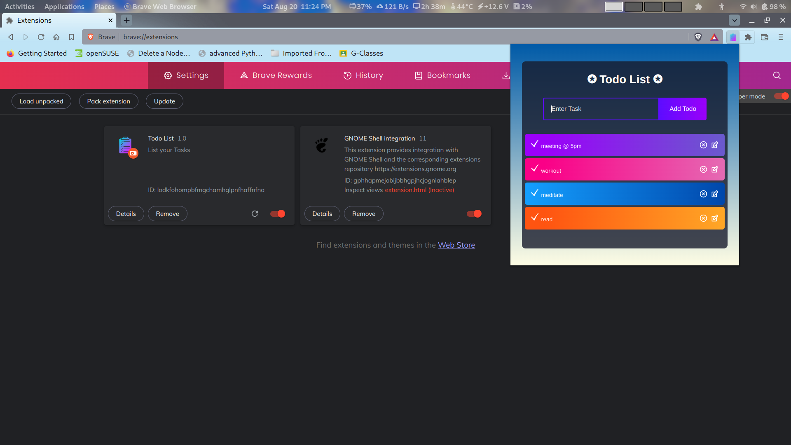
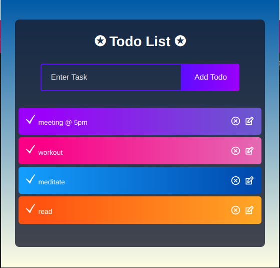
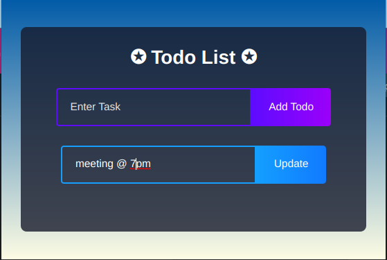
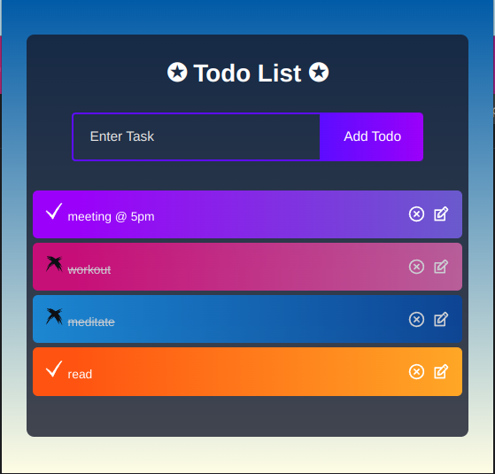
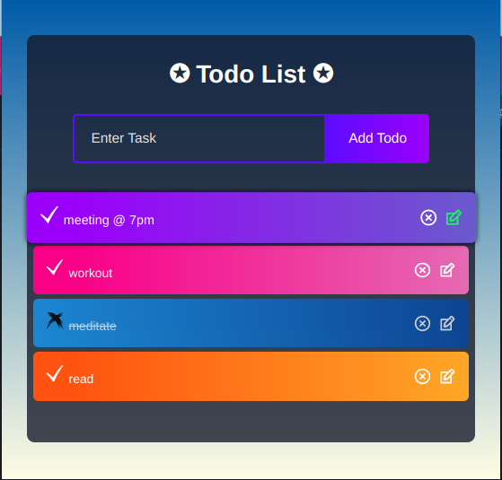

<div id="top"></div>

<!-- PROJECT SHIELDS -->
<!--
-->

[![Contributors][contributors-shield]][contributors-url]
[![Forks][forks-shield]][forks-url]
[![Stargazers][stars-shield]][stars-url]
[![Issues][issues-shield]][issues-url]
[![MIT License][license-shield]][license-url]
[![LinkedIn][linkedin-shield]][linkedin-url]

<div align=center></div>


# TodoList_ChromeExtension
+ Chrome Extension to help you to create **task/goals** to increase productivity and divide your working into small tasks. 
+ Used the latest **manifest V3**.
+ **React Chrome extension**
+ Uses Local storage, hence your progress isnt lost.
+ CRUD app

 &ensp; **_To use it : just click it_ and follow the UI**

<br />

<!-- TABLE OF CONTENTS -->
<details>
  <summary>Table of Contents</summary>
  <ol>
    <li><a href="#extension-preview">Extension Preview</a></li>
    <li><a href="#list-operations">List Operations</a></li>    
    <li><a href="#getting-started">Getting Started</a></li>        
        <ul>
            <li><a href="#1-clone-the-repo">Clone The Repo</a></li>
            <li><a href="#2-download-and-extract">Download & Extract</a></li>
        </ul>
    <li><a href="#installation">Installation</a></li>
        <ul>
            <li><a href="#loading-the-extension-in-browser">Load Extension</a></li>
        </ul>
    <li><a href="#contact">Contact me</a></li>
  </ol>
</details>

<br/>

<!-- Extension Preview -->
## Extension Preview
Here you can clearly see how the extension looks .


<br />

<div align=center></div>

<br />

<div align=center></div>

<br />

<div align=center></div>

<br />

<div align=center></div>

<br />

<div align=center></div>

<p align="right">(<a href="#top">Back to top</a>)</p>


<!-- List Operations -->
## List Operations

Possible operations in this Chrome Extension:
- Create Todo
- Read Todo
- Update Todo
- Delete Todo
- Change State of Todo


 <p align="right">(<a href="#top">Back to top</a>)</p>

<!-- Getting Started -->
 ## Getting Started
 
 Firstly download this extension via either of the following methods:


 <!-- Clone the Repo -->
### 1: Clone the repo
+ Via https 
   ```
   https://github.com/VENGENCE7/TodoList_ChromeExtension.git
   ```
+ Via Github CLI
   ```sh
    gh repo clone VENGENCE7/TodoList_ChromeExtension
   ```


<!-- Download and Extract -->
### 2: Download and Extract
 + Download the extension from <a href="https://github.com/VENGENCE7/TodoList_ChromeExtension/releases"> releases </a>.
 + Download the one you need
 + Options Avaialable:
    - **.tar.xz**
    - **.zip**
    - **.7z**
 + Extract the particualr compressed file
    
 
 
<!-- Installations -->
## Installation

+ Go to the below _Extensions_ page using the address below
 + For Chrome
```
chrome://extensions/
```

 + For brave
 ```
brave://extensions/
```

**OR**

1. Open `Chrome Browser` or `Brave Browser`.
2. Go to the `jigsaw-puzzle icon`- which is the extensions icon.
3. Manage extensions


<!-- Load the Extension -->
### Loading the Extension in browser

1. Make sure to enable the `Developer mode` on _top Right_ here.
2. Once that's done, you need to click the `Load unpacked button` which will allow us to load our project in the Chrome extension store.
3. Select the folder containing `manifest.json` file.

**Now, the extension is available in our Chrome extension dashboard. You can also pin the extension in the browser**


 <p align="right">(<a href="#top">Back to top</a>)</p>
 
 <!-- CONTACT -->
## Contact

Bhavish Anand- bhavish007anand@gmail.com

Project Link: [https://github.com/VENGENCE7/TodoList](https://github.com/VENGENCE7/TodoList_ChromeExtension)

Github Profile : [https://github.com/VENGENCE7](https://github.com/VENGENCE7)

<p align="right">(<a href="#top">back to top</a>)</p>
 

<!-- MARKDOWN LINKS & IMAGES -->
<!-- https://www.markdownguide.org/basic-syntax/#reference-style-links -->
[contributors-shield]: https://img.shields.io/github/contributors/VENGENCE7/TodoList_ChromeExtension.svg?style=for-the-badge
[contributors-url]: https://github.com/VENGENCE7/TodoList_ChromeExtension/graphs/contributors

[forks-shield]: https://img.shields.io/github/forks/VENGENCE7/TodoList_ChromeExtension.svg?style=for-the-badge
[forks-url]: https://github.com/VENGENCE7/TodoList_ChromeExtension/network/members

[stars-shield]: https://img.shields.io/github/stars/VENGENCE7/TodoList_ChromeExtension.svg?style=for-the-badge
[stars-url]: https://github.com/VENGENCE7/TodoList_ChromeExtension/stargazers

[issues-shield]: https://img.shields.io/github/issues/VENGENCE7/TodoList_ChromeExtension.svg?style=for-the-badge
[issues-url]: https://github.com/VENGENCE7/TodoList_ChromeExtension/issues

[license-shield]: https://img.shields.io/github/license/VENGENCE7/TodoList_ChromeExtension.svg?style=for-the-badge
[license-url]: https://github.com/VENGENCE7/TodoList_ChromeExtension/blob/main/LICENSE


[linkedin-shield]: https://img.shields.io/badge/LinkedIn-0077B5?style=for-the-badge&logo=linkedin&logoColor=white
[linkedin-url]: https://linkedin.com/in/bhavish-anand-2113a6206
